## Identitas Mahawiswa

| Info | Detail |
| --- | --- |
| Nama | Maria Euhrasia Ardynati |
| NIM | 1123150050 |
| Kelas | TISE23M |
| Mata Kuliah | KB1154 - Aplikasi Mobile Lanjutan |

## 📱 Dompet Digital
*MUU Wallet* adalah aplikasi dompet digital yang dirancang untuk memberikan kemudahan dalam melakukan berbagai transaksi pembayaran secara aman dan efisien. Aplikasi ini memungkinkan pengguna melakukan pengisian saldo (Top Up), transfer saldo antar pengguna, serta pembayaran transaksi pada aplikasi e-commerce penjualan tas dengan proses yang cepat dan praktis.

Untuk meningkatkan keamanan setiap transaksi, MOO Wallet dilengkapi dengan fitur Autentikasi Dua Langkah (2FA) menggunakan Google Authenticator (TOTP). Selain itu, aplikasi ini juga mendukung integrasi Deep Link, sehingga proses pembayaran dari aplikasi e-commerce dapat dilakukan secara langsung tanpa perlu berpindah aplikasi secara manual, memberikan pengalaman transaksi yang lebih nyaman dan efisien.


## 📱 Bag Store
*BagStore* adalah aplikasi e-commerce yang dirancang untuk memudahkan pengguna dalam berbelanja berbagai koleksi tas secara online dengan tampilan antarmuka yang modern, menarik, dan mudah digunakan. Aplikasi ini memungkinkan pengguna untuk menjelajahi katalog produk, melihat detail tas, menambahkan produk ke keranjang, mengelola pesanan, hingga melakukan pembayaran dengan proses yang cepat dan praktis.

Aplikasi ini telah terintegrasi dengan MUU Wallet melalui fitur *Deep Link Payment*, sehingga pengguna dapat melakukan pembayaran secara langsung menggunakan dompet digital tanpa harus memasukkan data pembayaran secara manual. Dengan desain UI yang responsif dan pengalaman pengguna yang intuitif, BagStore memberikan proses berbelanja yang lebih mudah, aman, dan nyaman.

---

## 🔗 Project Terkait

Berikut merupakan repository yang saling terhubung dalam pengembangan sistem, mulai dari backend hingga aplikasi mobile.

| **Project**             | **Repository GitHub**                                      |
| ----------------------- | ---------------------------------------------------------- |
| Backend E-Commerce Tas  | https://github.com/Mariariaardyanti/mycatalog-be.git |
| Aplikasi E-Commerce Tas | https://github.com/Mariariaardyanti/UAS_SEM6.git  |
| Backend MOO Wallet      | https://github.com/Mariariaardyanti/be-emoney.git      |
| Aplikasi MOO Wallet     | https://github.com/Mariariaardyanti/dompet_digital.git   |

---

## 🏗️ Arsitektur Aplikasi Dompet Muu
Aplikasi ini dikembangkan menggunakan pendekatan **Clean Architecture** untuk menghasilkan struktur kode yang lebih terorganisir, mudah dipelihara, dan fleksibel ketika dilakukan pengembangan fitur baru. Arsitektur aplikasi dibagi menjadi tiga lapisan utama yang memiliki tanggung jawab masing-masing.

1. **Domain Layer (`lib/domain/`)**
   Merupakan lapisan inti yang berisi aturan bisnis utama (*business logic*) dan tidak bergantung pada framework maupun library eksternal.
    - **Entities** → Merepresentasikan objek atau model bisnis utama, seperti `UserEntity` dan `AccountEntity`.
    - **Repository Interface** → Mendefinisikan kontrak yang akan diimplementasikan pada Data Layer.
    - **Use Cases** → Berisi logika bisnis aplikasi, seperti `TopUpUseCase`, `TransferUseCase`, dan `DeepLinkPaymentUseCase`.

2. **Data Layer (`lib/data/`)**
   Layer ini bertugas mengelola seluruh sumber data yang digunakan aplikasi, baik yang berasal dari API maupun penyimpanan lokal.
    - **Data Sources** → Menghubungkan aplikasi dengan REST API menggunakan **Dio**, serta mengelola penyimpanan lokal menggunakan **FlutterSecureStorage** dan **SharedPreferences**.
    - **Repository Implementation** → Implementasi dari repository yang telah didefinisikan pada Domain Layer.


3. **Presentation Layer (`lib/presentation/`)**
   Layer yang bertanggung jawab terhadap tampilan aplikasi serta interaksi pengguna.
    - **BLoC** → Digunakan sebagai *state management* untuk mengatur alur data dan logika tampilan, seperti `AuthBloc` dan `PaymentBloc`.
    - **Pages** → Berisi halaman-halaman utama yang ditampilkan kepada pengguna.
    - **Widgets** → Kumpulan komponen antarmuka (*reusable widgets*) yang dapat digunakan kembali pada berbagai halaman.


## 🏗️ Arsitektur Aplikasi Bag Store

Aplikasi **BagStore** dikembangkan menggunakan pendekatan **Feature-Based Architecture** yang dipadukan dengan pemisahan modul pada setiap fitur. Struktur ini bertujuan agar pengembangan aplikasi menjadi lebih terorganisir, mudah dipelihara, serta memudahkan penambahan fitur baru di masa mendatang.

1. Core (`lib/core/`)
    Folder **Core** berisi berbagai komponen yang digunakan secara global oleh seluruh fitur dalam aplikasi.

    Beberapa modul yang terdapat pada folder ini antara lain:

    - **Constants (`core/constants/`)**
    - Menyimpan konstanta aplikasi seperti konfigurasi API, warna aplikasi, dan kumpulan string.
    - **Providers (`core/providers/`)**
    - Berisi provider global, seperti pengaturan tema aplikasi (`ThemeProvider`).
    - **Routes (`core/routes/`)**
    - Mengatur navigasi antar halaman menggunakan **Go Router**.
    - **Services (`core/services/`)**
    - Menangani berbagai layanan aplikasi, seperti:
        - Komunikasi dengan REST API menggunakan **Dio**
        - Penyimpanan data menggunakan **Secure Storage**
        - Layanan notifikasi
        - Autentikasi biometrik
        - Integrasi layanan pembayaran
    - **Theme (`core/theme/`)**
    - Mengelola tema, warna, dan tampilan visual aplikasi.
    - **Widgets (`core/widgets/`)**
    - Berisi kumpulan widget yang dapat digunakan kembali pada berbagai halaman aplikasi.

2. Features (`lib/features/`)
    Seluruh fitur utama aplikasi dikelompokkan ke dalam folder **Features** sehingga setiap modul memiliki tanggung jawab yang jelas dan lebih mudah dikembangkan.

    Fitur yang tersedia meliputi:

    - **Auth**
    - Mengelola proses autentikasi pengguna, seperti login, registrasi, dan verifikasi akun.
    - **Dashboard**
    - Menampilkan halaman utama yang berisi katalog produk, promo, serta informasi penting lainnya.
    - **Cart**
    - Mengelola keranjang belanja, mulai dari menambah, mengubah jumlah, hingga menghapus produk.
    - **Favorite**
    - Menyimpan daftar produk favorit agar mudah diakses kembali oleh pengguna.
    - **Order**
    - Mengelola proses checkout, pembayaran, serta riwayat transaksi pembelian.
    - **Profile**
    - Menampilkan informasi pengguna serta pengaturan akun.

---

### 🗂️ Struktur Folder & File
```text
emoneyid/
├── android/
│   └── app/src/main/
│       ├── AndroidManifest.xml                ← Intent filter deep link
│       ├── res/                               ← Sumber daya Android (icon, splash, dll)
│       └── kotlin/com/example/emoneyid/
│           └── MainActivity.kt                ← Activity utama Android
├── ios/                                       ← Konfigurasi & resource iOS
├── web/                                       ← Konfigurasi & resource Web
├── linux/                                     ← Konfigurasi & resource Linux
├── macos/                                     ← Konfigurasi & resource macOS
├── windows/                                   ← Konfigurasi & resource Windows
├── test/                                      ← Unit & Widget tests
├── .gitignore
├── .metadata
├── analysis_options.yaml                      ← Aturan linting Dart
├── pubspec.yaml                               ← Dependencies utama
├── pubspec.lock                               ← Version lock dependencies
├── README.md
└── lib/
    ├── main.dart                              ← Entry point + deep link init
    ├── firebase_options.dart                  ← Konfigurasi Firebase otomatis
    ├── core/
    │   ├── constants/
    │   │   ├── api_endpoints.dart             ← Endpoints API (base URL, paths)
    │   │   └── app_constants.dart             ← Konstanta aplikasi (timeout, dll)
    │   ├── error/
    │   │   ├── exceptions.dart                ← Custom exception classes
    │   │   └── failures.dart                  ← Failure classes (untuk BLoC handling)
    │   ├── network/
    │   │   └── api_client.dart                ← Konfigurasi HTTP Client (Dio)
    │   ├── router/
    │   │   └── app_router.dart                ← Konfigurasi rute (go_router)
    │   ├── services/
    │   │   └── updated_deep_link_handler.dart ← Listener Deep Link (app_links)
    │   ├── theme/
    │   │   ├── app_colors.dart                ← Palet warna tema
    │   │   ├── app_text_styles.dart           ← Gaya teks kustom
    │   │   └── app_theme.dart                 ← Konfigurasi ThemeData
    │   └── utils/
    │       ├── app_bloc_observer.dart         ← Observer untuk debugging BLoC
    │       ├── currency_formatter.dart        ← Formatter Rupiah (Rp)
    │       └── date_formatter.dart            ← Formatter tanggal/waktu
    ├── data/
    │   ├── models/
    │   │   ├── account_model.dart             ← Model data akun
    │   │   ├── transaction_model.dart         ← Model data transaksi
    │   │   └── user_model.dart                ← Model data pengguna
    │   ├── datasources/
    │   │   ├── local/
    │   │   │   ├── secure_storage_datasource.dart  ← Penyimpanan token JWT
    │   │   │   └── balance_preferences_datasource.dart ← Sinkronisasi saldo lokal
    │   │   └── remote/
    │   │       ├── auth_remote_datasource.dart      ← API Autentikasi
    │   │       ├── account_remote_datasource.dart   ← API Akun
    │   │       ├── otp_remote_datasource.dart       ← API OTP
    │   │       ├── payment_remote_datasource.dart   ← API Pembayaran
    │   │       ├── mock_auth_remote_datasource.dart     ← Mock data auth (dev)
    │   │       ├── mock_account_remote_datasource.dart  ← Mock data akun (dev)
    │   │       ├── mock_otp_remote_datasource.dart      ← Mock data OTP (dev)
    │   │       └── mock_payment_remote_datasource.dart  ← Mock data pembayaran (dev)
    │   └── repositories/
    │       ├── account_repository_impl.dart   ← Implementasi repository akun
    │       ├── auth_repository_impl.dart      ← Implementasi repository auth
    │       ├── otp_repository_impl.dart       ← Implementasi repository OTP
    │       └── payment_repository_impl.dart   ← Implementasi repository pembayaran
    ├── domain/
    │   ├── entities/
    │   │   ├── account_entity.dart            ← Entitas akun
    │   │   ├── deeplink_payment_entity.dart   ← Entitas pembayaran Deep Link
    │   │   ├── otp_entity.dart                ← Entitas OTP
    │   │   ├── payment_result_entity.dart     ← Entitas hasil pembayaran
    │   │   ├── transaction_entity.dart        ← Entitas transaksi
    │   │   └── user_entity.dart               ← Entitas pengguna
    │   ├── repositories/
    │   │   ├── account_repository.dart        ← Interface repository akun
    │   │   ├── auth_repository.dart           ← Interface repository auth
    │   │   ├── otp_repository.dart            ← Interface repository OTP
    │   │   └── payment_repository.dart        ← Interface repository pembayaran
    │   └── usecases/
    │       ├── account/
    │       │   └── get_account_usecase.dart   ← Ambil data akun
    │       ├── auth/
    │       │   ├── get_me_usecase.dart        ← Ambil data profil login
    │       │   ├── logout_usecase.dart        ← Logout pengguna
    │       │   ├── register_with_otp_usecase.dart ← Registrasi + OTP
    │       │   ├── send_otp_usecase.dart      ← Kirim OTP
    │       │   ├── verify_email_otp_usecase.dart   ← Verifikasi OTP email
    │       │   └── verify_firebase_token_usecase.dart ← Verifikasi token Firebase
    │       └── payment/
    │           └── payment_usecases.dart      ← Usecase pembayaran (topup, transfer, dll)
    ├── data/repositories/                     ← Implementasi Interface Domain
    ├── injection/
    │   └── injection_container.dart           ← Setup Dependency Injection (get_it)
    └── presentation/
        ├── blocs/
        │   ├── account/
        │   │   └── account_bloc.dart          ← BLoC state akun & saldo
        │   ├── auth/
        │   │   ├── auth_bloc.dart             ← BLoC autentikasi utama
        │   │   └── otp_bloc.dart              ← BLoC alur OTP/registrasi
        │   └── payment/
        │       └── payment_bloc.dart          ← BLoC alur pembayaran
        ├── pages/
        │   ├── account/
        │   │   └── account_page.dart          ← Halaman profil & akun
        │   ├── auth/
        │   │   ├── login_page.dart            ← Halaman masuk
        │   │   ├── register_page.dart         ← Halaman pendaftaran
        │   │   ├── verify_email_page.dart     ← Halaman verifikasi email
        │   │   ├── setup_2fa_page.dart        ← Halaman pengaturan 2FA
        │   │   ├── twofa_totp_page.dart       ← Halaman autentikasi TOTP
        │   │   ├── twofa_notif_page.dart      ← Halaman notifikasi 2FA
        │   │   └── twofa_smtp_page.dart       ← Halaman SMTP 2FA
        │   ├── history/
        │   │   └── history_page.dart          ← Halaman riwayat transaksi
        │   ├── home/
        │   │   └── home_page.dart             ← Halaman beranda utama
        │   ├── merchant/
        │   │   └── merchant_checkout_page.dart ← Halaman checkout merchant
        │   ├── payment/
        │   │   ├── payment_qr_page.dart       ← Halaman bayar via QR
        │   │   ├── deeplink_payment_page.dart ← Halaman bayar via Deep Link
        │   │   └── pin_page.dart              ← Halaman input PIN pembayaran
        │   ├── promo/
        │   │   └── promo_page.dart            ← Halaman promosi/banner
        │   ├── splash/
        │   │   └── splash_page.dart           ← Halaman splash screen
        │   ├── success/
        │   │   └── success_page.dart          ← Halaman sukses transaksi
        │   ├── topup/
        │   │   └── topup_page.dart            ← Halaman isi saldo
        │   └── transfer/
        │       ├── transfer_page.dart         ← Halaman transfer utama
        │       ├── transfer_amount_page.dart  ← Halaman input nominal transfer
        │       └── transfer_confirm_page.dart ← Halaman konfirmasi transfer
        └── widgets/
            ├── app_avatar.dart                ← Widget avatar pengguna
            ├── app_badge.dart                 ← Widget badge notifikasi
            ├── app_button.dart                ← Widget tombol kustom
            ├── app_field.dart                 ← Widget input field
            ├── app_logo.dart                  ← Widget logo aplikasi
            ├── app_tab_bar.dart               ← Widget tab bar
            ├── app_top_bar.dart               ← Widget top bar / header
            ├── brutalism_3d_icon.dart         ← Widget ikon 3D gaya brutalism
            ├── brutalism_nav_bar.dart         ← Widget bottom navigation bar
            ├── code_input.dart                ← Widget input kode OTP
            ├── feature_icon.dart              ← Widget ikon fitur
            ├── num_pad.dart                   ← Widget numpad (PIN)
            ├── pin_pad.dart                   ← Widget keypad PIN
            ├── profile_greeting_widget.dart   ← Widget sapaan profil
            ├── success_check.dart             ← Widget animasi centang sukses
            └── transaction_row.dart           ← Widget baris riwayat transaksi
```
## 🚀 Cara Menjalankan Aplikasi

Ikuti langkah-langkah berikut untuk menjalankan aplikasi **BagStore dan Dompet Muu** pada perangkat lokal.

### 1. Clone Repository

Clone repository ke komputer Anda menggunakan perintah berikut:

```bash
git clone <url-repository>
cd pasar_malam
```

### 2. Install Dependencies

Pastikan seluruh package yang dibutuhkan telah terpasang dengan menjalankan:

```bash
flutter pub get
```

### 3. Konfigurasi API Backend (Opsional)

Secara bawaan aplikasi akan menggunakan alamat API yang telah ditentukan pada project. Apabila Anda menggunakan backend dengan alamat yang berbeda, URL API dapat disesuaikan melalui parameter `--dart-define` saat menjalankan aplikasi.

```bash
flutter run --dart-define=API_BASE_URL=http://<IP_SERVER>:8080
```

### 4. Menjalankan Aplikasi

Setelah seluruh konfigurasi selesai, jalankan aplikasi menggunakan perintah berikut:

```bash
flutter run
```

### Persyaratan
- Flutter SDK (Versi terbaru disarankan)
- Dart SDK
- Android Studio / VS Code
- Emulator atau Perangkat Android (Disarankan Android 11+ untuk pengujian *Deep Link*)


> **💡 Catatan**
>
> Agar seluruh fitur aplikasi, seperti autentikasi, pengelolaan produk, keranjang belanja, checkout, hingga pembayaran dapat berjalan dengan baik, pastikan backend telah aktif dan dapat diakses oleh aplikasi melalui alamat API yang digunakan.


## Dependensi Utama

| Dependency | Fungsi |
| --- | --- |
| `flutter_bloc` | State management. |
| `get_it` | Dependency injection. |
| `go_router` | Routing aplikasi. |
| `dio` | HTTP client ke backend. |
| `firebase_core` | Inisialisasi Firebase. |
| `firebase_auth` | Autentikasi Firebase. |
| `firebase_messaging` | FCM dan notifikasi. |
| `google_sign_in` | Login menggunakan Google. |
| `flutter_secure_storage` | Penyimpanan token dan session. |
| `shared_preferences` | Penyimpanan preferensi sederhana. |
| `app_links` | Deep link payment. |
| `mobile_scanner` | Fitur scan QR. |
| `intl` | Format tanggal dan mata uang. |

---

## 📸 Hasil Screenshot Tampilan Aplikasi

## 📸 Hasil Screenshot Tampilan Aplikasi

### 👜 Bag Store

<table>
  <tr>
    <td align="center"><b>1. Splash Screen</b></td>
    <td align="center"><b>2. Login</b></td>
    <td align="center"><b>3. Register</b></td>
  </tr>
  <tr>
    <td align="center">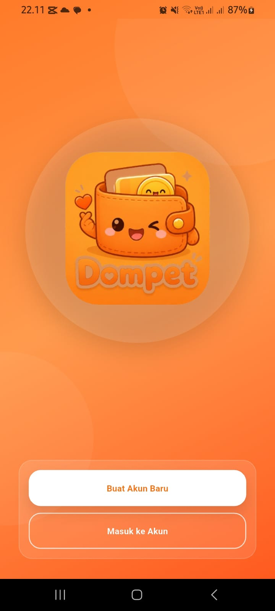</td>
    <td align="center">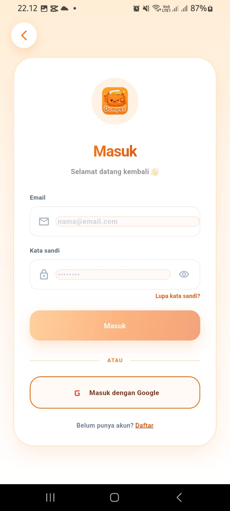</td>
    <td align="center">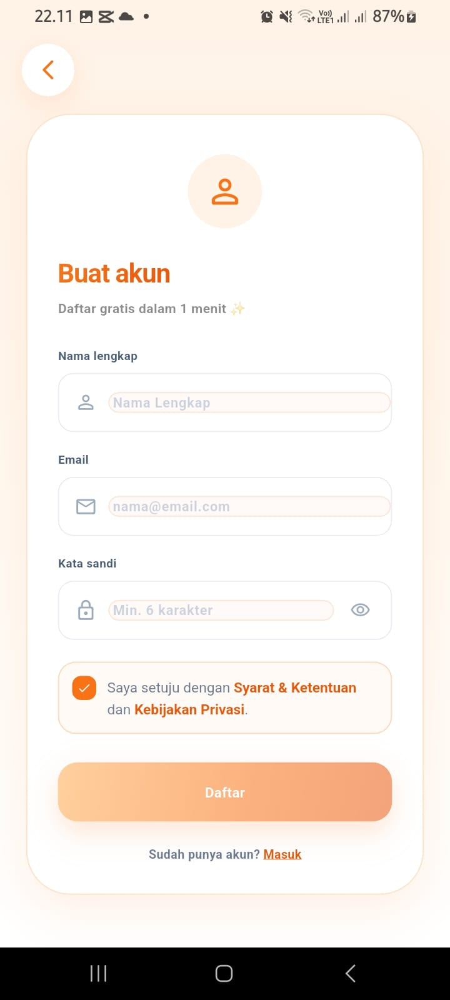</td>
  </tr>

  <tr>
    <td align="center"><b>4. Home</b></td>
    <td align="center"><b>5. Detail Produk</b></td>
    <td align="center"><b>6. Keranjang</b></td>
  </tr>
  <tr>
    <td align="center">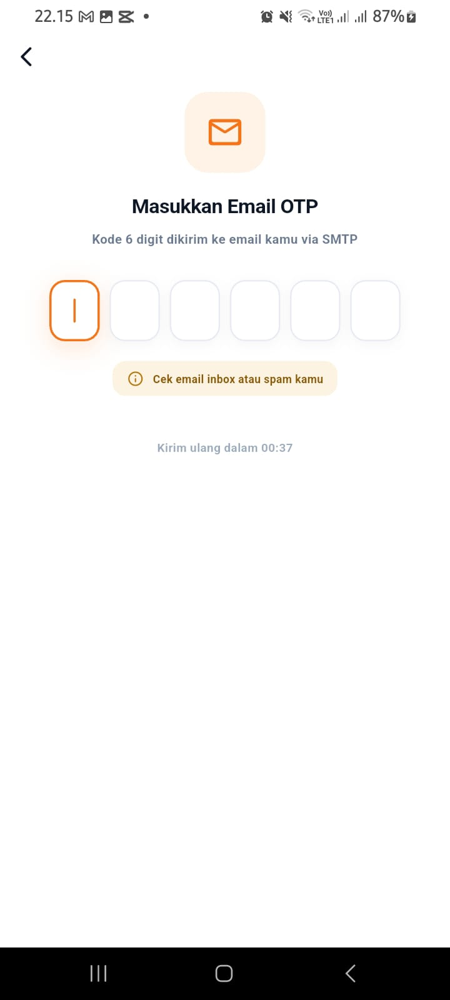</td>
    <td align="center">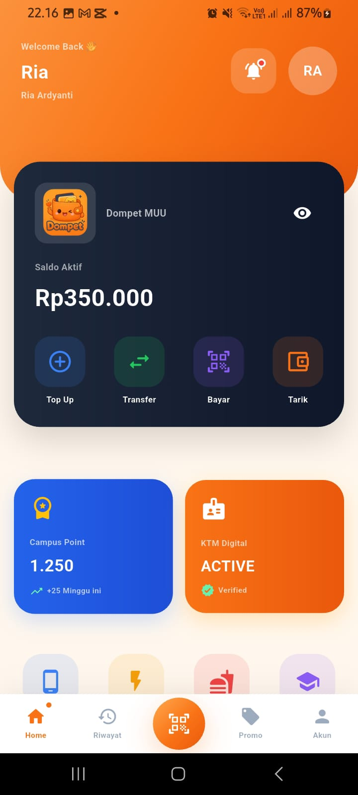</td>
    <td align="center">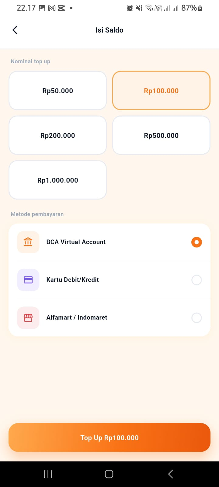</td>
  </tr>

  <tr>
    <td align="center"><b>7. Favorit</b></td>
    <td align="center"><b>8. Checkout</b></td>
    <td align="center"><b>9. Riwayat Pesanan</b></td>
  </tr>
  <tr>
    <td align="center">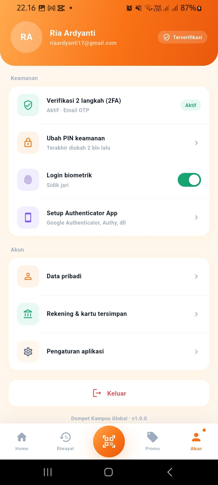</td>
    <td align="center">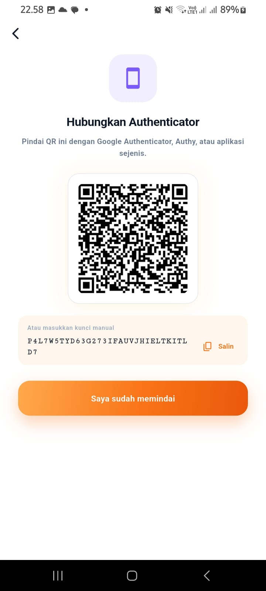</td>
    <td align="center">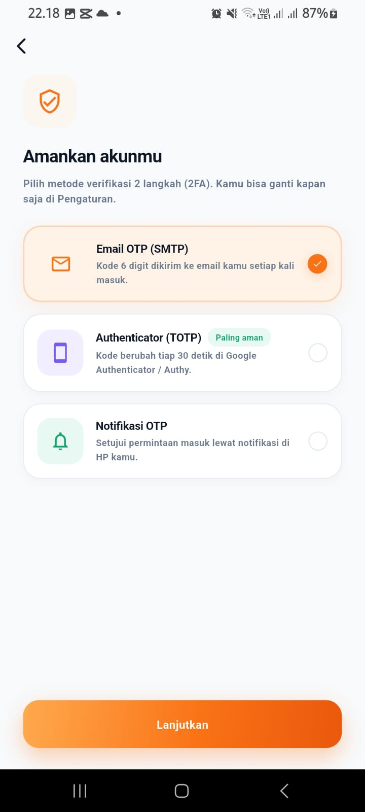</td>
  </tr>

  <tr>
    <td align="center"><b>10. Profil</b></td>
    <td align="center"><b>11. Edit Profil</b></td>
    <td></td>
  </tr>
  <tr>
    <td align="center">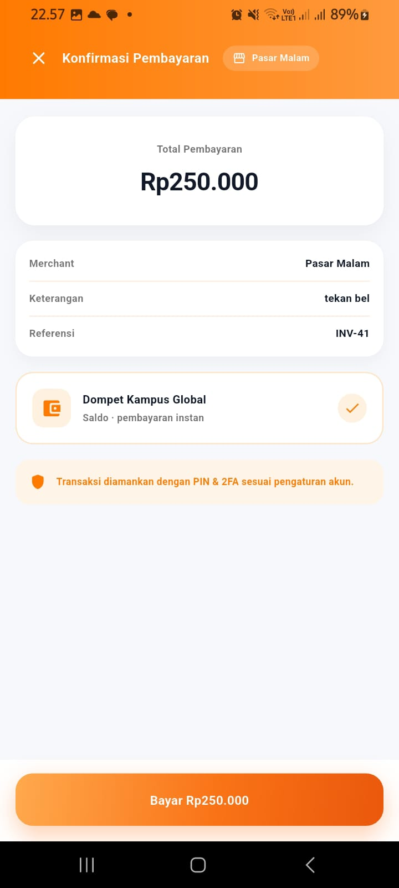</td>
    <td align="center">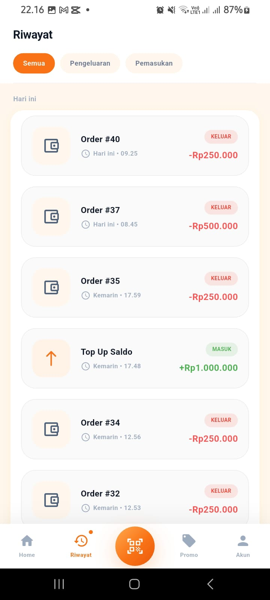</td>
    <td></td>
  </tr>
</table>